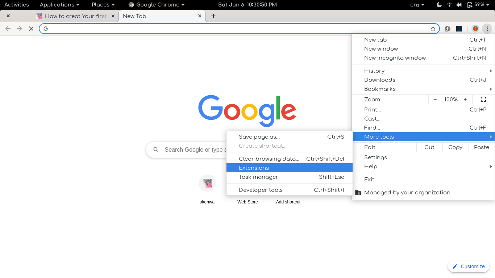
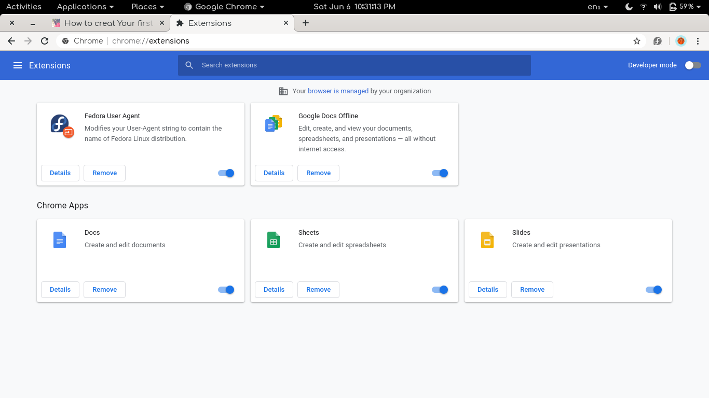
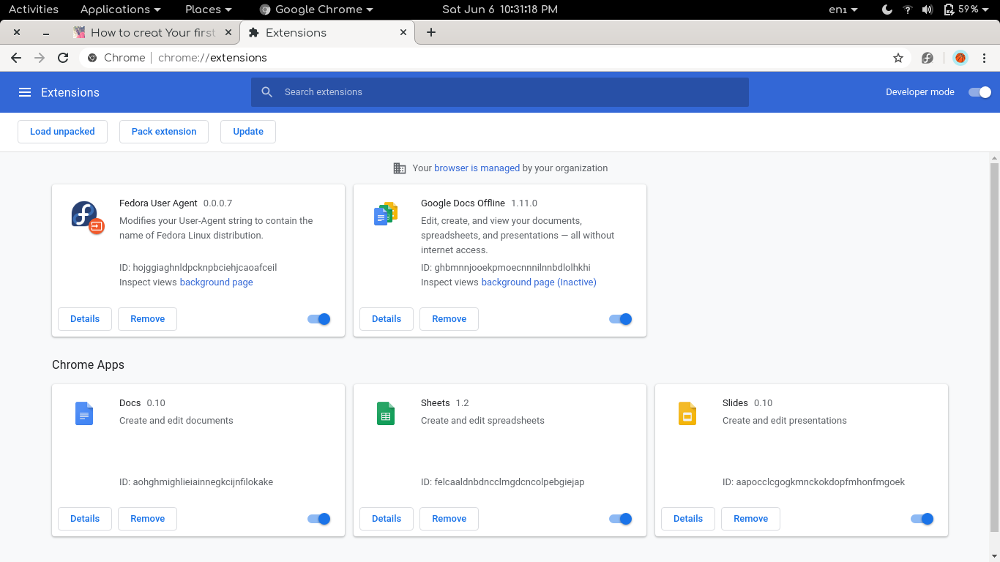
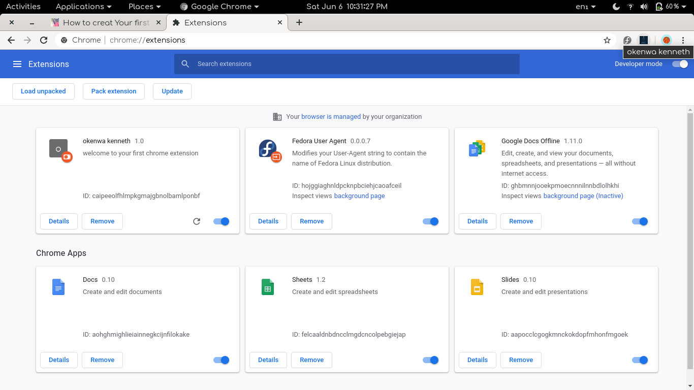
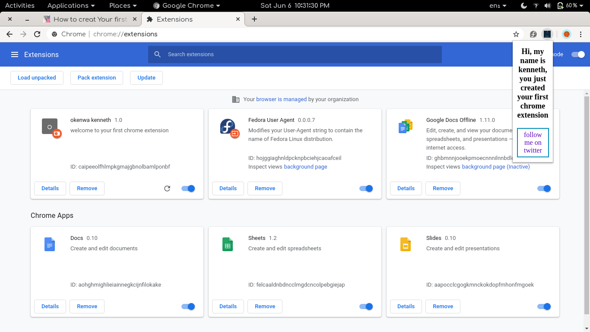

Chrome extensions are a greate thing to have on your chrome browser.

In this article we are going to create our first chrome extension and install it on our chrome browser.

First lets make a folder that will contain our files.

```terminal
 mkdir chrome-extension
 ```
you do this manually by creating a folder on your device and give it any name you like.

let's go into the folder and create files that we are working with.

```terminal
cd chrome-extension

#and 

mkdir logo
touch index.js
touch index.html
touch style.css
```

let's start coding. We begin with the structure first, which is html code.
Inside the **index.html** add the following code.

```html
<!DOCTYPE html>
<html lang="en">
<head>
    <meta charset="UTF-8">
    <meta name="viewport" content="width=device-width, initial-scale=1.0">
    <link rel="stylesheet" href="style.css">
    <title>First Extension</title>
    <!--<script src="popUp.js"></script>-->
</head>
<body>
    
    <h2>Hi, my name is kenneth, you just created your first chrome extension</h2>
    <a href="http://twitter.com/anekenonso1" id="checkPage" class="button button2">follow me on twitter</a>

    <script src="popup.js"></script>
</body>
</html>
```

save it and then move to the **style.css** and copy and paste this code

```css
body{
    min-width: 50%;
    text-align: center;
    font-family: Georgia, 'Times New Roman', Times, serif;
}

.button{
    background-color: solid #2e4266;
    border: none;
    color: #fff;
    padding: 5px 14px;
    text-align: center;
    text-decoration: none;
    display: inline-block;
    font-size: 16px;
    margin: 4px 2px;
    transition-duration: 0.3s;
    cursor: pointer;
}
.button2{
    background-color: #fff;
    color: #5e04c5;
    border: 2px solid #008cba;
}
.button2:hover{
    background-color:  #0e021b;
    color: #fff;
}
```

Then the last step in writing the code is to move to the **index.js** and copy paste this code.

```javascript
document.addEventListener('DOMContentLoaded', function() {  
    var checkPageButton = document.getElementById('checkPage');  
    checkPageButton.addEventListener('click', function() {  
        chrome.tabs.getSelected(null, function(tab) {  
            d = document;  
            window.open('https://twitter.com/anekenonso1');  
        });  
    }, false);  
}, false);
```

Save the files and Viola!!!! we just created our first chrome extension right? not realy. this will not work because we did not include the **manifest.json** file.

What is **manifest.json** file and what does it have to do with our pretty chrome extension? you might ask.

Every chrome extension has a JSON-formatted manifest file, named manifest.json, that provides important information. you can read more about manifest files [here](https://developer.chrome.com/apps/manifest)

So back to our code. let's create a manifest file

```terminal
mkdir manifest.json
```

And add the following code inside the file and save

```JSON
{  
    "manifest_version": 2,  
    "name": "okenwa kenneth",  
    "description": "welcome to your first chrome extension",  
    "version": "1.0",  
    "browser_action": {  
        "default_icon": "logo/logo.png",  
        "default_popup": "popup.html"  
    },  
    "permissions": ["activeTab"]  
}
```

Inside the logo folder we created earlier add logo you would like to use and save.

Our extension is ready for use on our chrome browser.

Let's add our chrome extention to the browser so we can start using it 

First open chrome and go to more tools then extension


At the top right hand corner you will see **Developer mode**, click to activate it if you haven't done that. 


After you activate the developer mode you should see three options at the top left hand corner just above the installed extensions.
Click on the option that says **Load unpacked**


It will prompt you to select the folder where the extension is. select the folder that contain the extension, in our case it is the **chrome-extension** folder


The extension will be loaded and we can see it at the top right hand corner of our browser where extension icons are. click on the icon and you should get a popup massage. 


CONGRATULATIONS, we just created our very first chrome extension.

the entire code for this project is available on [Github](https://github.com/Anekenonso/make-chrome-extension).

I hope this post help you get your first chrome extension up and running. if you need help in creating a chrome extension, or need help with any other Javascript or web development in general, i'm available on [Upwork](https://www.upwork.com/o/profiles/users/~0109de556cd2771e84/?s=1110580755057594368).